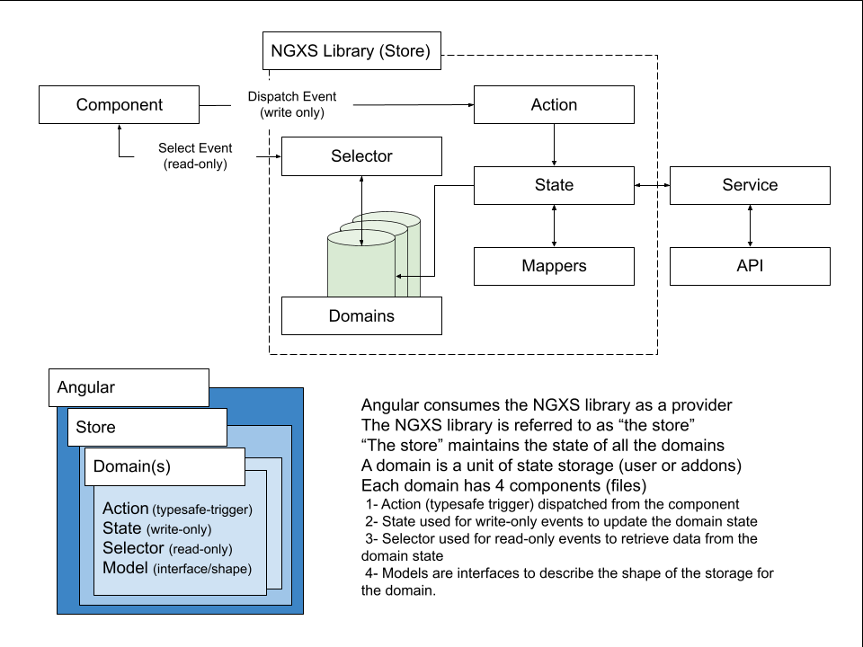

# NGXS State Management

## Index

- [Purpose](#purpose)
- [Core Concepts](#core-concepts)
- [Directory Structure](#directory-structure)
- [State Models](#state-models)
- [Tooling and Extensions](#tooling-and-extensions)
- [Testing](#testing)
- [Documentation](#documentation)

---

## Overview

The OSF Angular project uses [NGXS](https://www.ngxs.io/) as the state management library for Angular applications. NGXS provides a simple, powerful, and TypeScript-friendly framework for managing state across components and services.

---

## Purpose

The goal of using NGXS is to centralize and streamline the handling of application state, reduce boilerplate, and maintain a predictable flow of data and events throughout the OSF Angular app.

---

## Core Concepts

- **State**: Defines a slice of the application state and how it is modified in response to actions.
- **Actions**: Dispatched to signal state changes or trigger effects (e.g., API calls).
- **Selectors**: Functions that extract and transform data from the store.
- **Store**: Centralized container that holds the application state.
- **Effects** (via `@ngxs-labs/effects` or `@ngxs/store`): Side-effect handling such as HTTP requests, logging, etc.

### Diagram

[](./assets/osf-ngxs-diagram.png)

---

## Directory Structure

Typical NGXS-related files are organized as follows:

```
src/app/shared/stores/
  └── addons/
      ├── addons.actions.ts       # All action definitions
      ├── addons.models.ts        # Interfaces & data models
      ├── addons.state.ts         # State implementation
      ├── addons.selectors.ts     # Reusable selectors
```

```
src/app/shared/services/
  └── addons/
      ├── addons.service.ts       # External API calls
```

---

## State Models

The OSF Angular project follows a consistent NGXS state model structure to ensure clarity, predictability, and alignment across all features. The recommended shape for each domain-specific state is as follows:

1. Domain state pattern:

```ts
domain: {
  data: [],             // Array of typed model data (e.g., Project[], User[])
  isLoading: false,     // Indicates if data retrieval (GET) is in progress
  isSubmitting: false,  // Indicates if data submission (POST/PUT/DELETE) is in progress
  error: null,          // Captures error messages from failed HTTP requests
}
```

2. `data` holds the strongly typed collection of entities defined by the feature's interface or model class.

3. `isLoading` is a signal used to inform the component and template layer that a read or fetch operation is currently pending.

4. `isSubmitting` signals that a write operation (form submission, update, delete, etc.) is currently in progress.

5. `error` stores error state information (commonly strings or structured error objects) that result from failed service interactions. This can be displayed in UI or logged for debugging.

Each domain state should be minimal, normalized, and scoped to its specific feature, mirroring the structure and shape of the corresponding OSF backend API response.

---

## Tooling and Extensions

- [Redux DevTools](https://github.com/zalmoxisus/redux-devtools-extension) is supported. Enable it in development via `NgxsReduxDevtoolsPluginModule`.
- [NGXS Logger Plugin](https://www.ngxs.io/plugins/logger) can be used for debugging dispatched actions and state changes.
- [NGXS Storage Plugin](https://www.ngxs.io/plugins/storage) allows selective persistence of state across reloads.

---

## Testing

- [Testing Strategy](docs/testing.md)
- [NGXS State Testing Strategy](docs/testing.md#ngxs-state-testing-strategy)

---

## Documentation

Refer to the official NGXS documentation for full API details and advanced usage:
[https://www.ngxs.io/docs](https://www.ngxs.io/docs)
