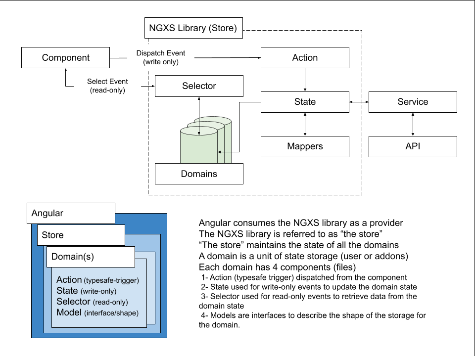

# NGXS State Management

## Index

- [Purpose](#purpose)
- [Core Concepts](#core-concepts)
- [Directory Structure](#directory-structure)
- [State Models](#state-models)
- [Tooling and Extensions](#tooling-and-extensions)
- [Testing](#testing)
- [Documentation](#documentation)

---

## Overview

The OSF Angular project uses [NGXS](https://www.ngxs.io/) as the state management library for Angular applications. NGXS provides a simple, powerful, and TypeScript-friendly framework for managing state across components and services.

---

## Purpose

The goal of using NGXS is to centralize and streamline the handling of application state, reduce boilerplate, and maintain a predictable flow of data and events throughout the OSF Angular app.

---

## Core Concepts

- **State**: Defines a slice of the application state and how it is modified in response to actions.
- **Actions**: Dispatched to signal state changes or trigger effects (e.g., API calls).
- **Selectors**: Functions that extract and transform data from the store.
- **Store**: Centralized container that holds the application state.
- **Effects** (via `@ngxs-labs/effects` or `@ngxs/store`): Side-effect handling such as HTTP requests, logging, etc.

### Diagram

[](./assets/osf-ngxs-diagram.png)

---

## Directory Structure

Typical NGXS-related files are organized as follows:

```
src/app/shared/stores/
  └── addons/
      ├── addons.actions.ts       # Action definitions
      ├── addons.model.ts         # State interface (*StateModel) and defaults
      ├── addons.state.ts          # State implementation
      ├── addons.selectors.ts     # Selectors
```

```
src/app/shared/services/
  └── addons/
      ├── addons.service.ts       # External API calls (map JSON:API → domain)
```

Feature stores follow the same file set under `features/<feature>/store/`. Core stores live under `core/store/`.

---

## State Models

State interfaces are named `*StateModel` and live in the colocated `*.model.ts` file. They are TypeScript interfaces (not classes). Domain entity types come from `shared/models` or feature `models/` — see [Models Conventions](./models.md).

Use `AsyncStateModel<T>` (and `AsyncStateWithTotalCount` when a total count is needed) from `shared/models/store/`:

```ts
export interface AsyncStateModel<T> {
  data: T;
  isLoading: boolean;
  isSubmitting?: boolean;
  error: string | null;
}
```

Example store shape:

```ts
export interface FilesStateModel {
  files: AsyncStateModel<FileModel[]>;
}
```

1. `data` holds strongly typed domain data (not raw JSON:API payloads when a domain model exists).
2. `isLoading` indicates a read/fetch is in progress.
3. `isSubmitting` indicates a write (create/update/delete) is in progress.
4. `error` stores a failed request message for UI or logging.

Each domain state should be minimal and scoped to its feature.

---

## Tooling and Extensions

- [Redux DevTools](https://github.com/zalmoxisus/redux-devtools-extension) is supported. Enable it in development via `NgxsReduxDevtoolsPluginModule`.
- [NGXS Logger Plugin](https://www.ngxs.io/plugins/logger) can be used for debugging dispatched actions and state changes.
- [NGXS Storage Plugin](https://www.ngxs.io/plugins/storage) allows selective persistence of state across reloads.

---

## Testing

- [Testing Strategy](./testing.md)
- [NGXS State Testing Strategy](./testing.md#15-testing-ngxs-state)

---

## Documentation

- [Models Conventions](./models.md)
- [Folder Structure](./arch.md)
- Official NGXS docs: [https://www.ngxs.io/docs](https://www.ngxs.io/docs)
